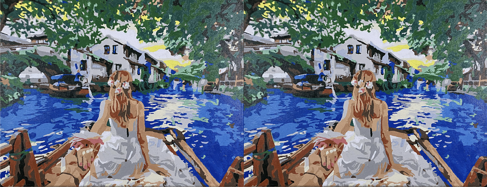

# Results:

# Reflections:

I modified the code to use inverse warping by mapping each destination pixel back to the source image using the inverse homography, which eliminated the gaps seen in forward warping and produced a complete transformed image.

